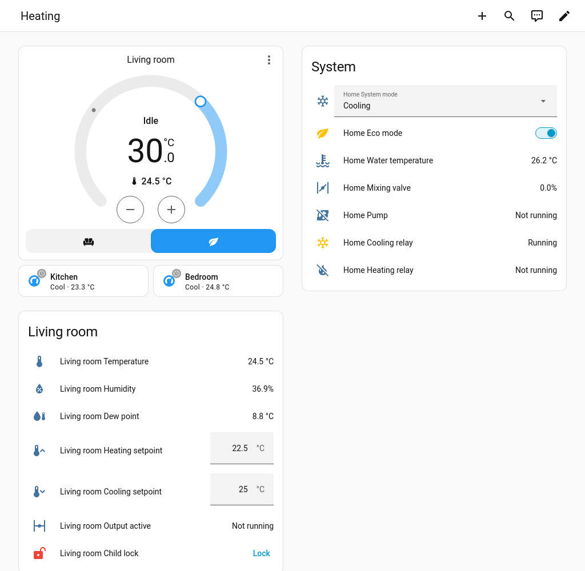
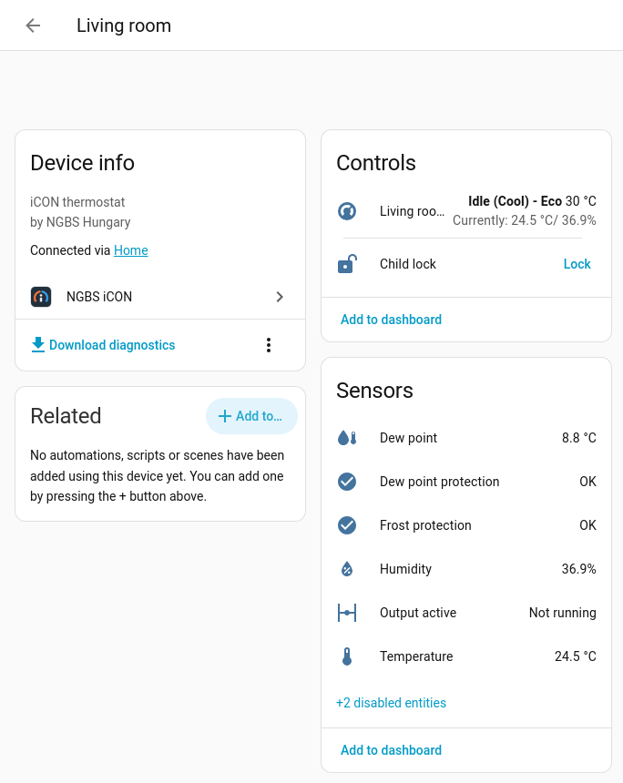
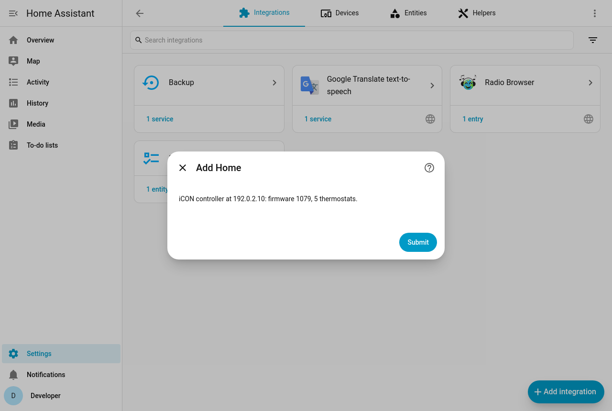
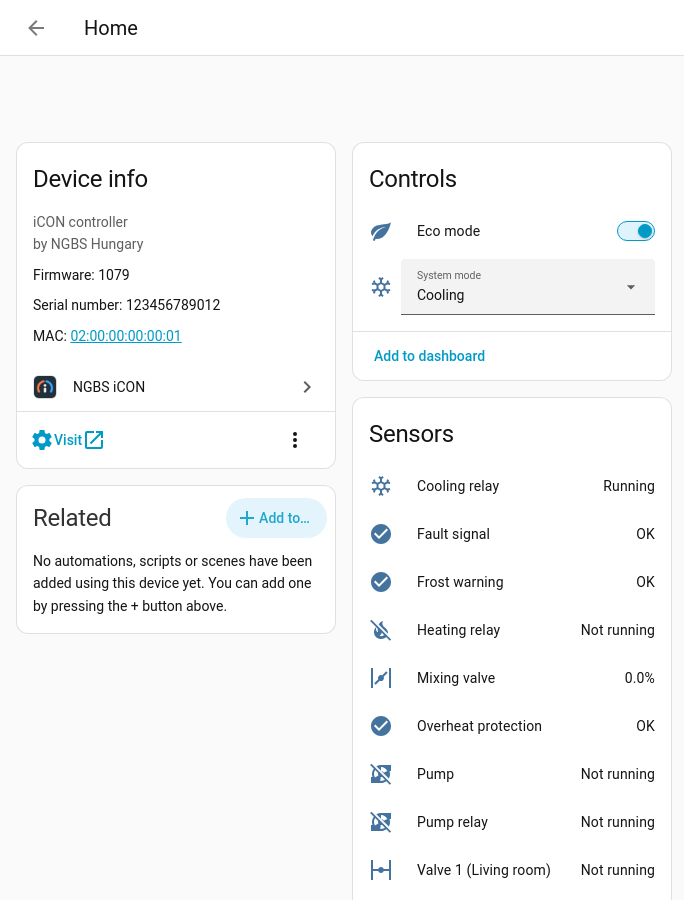

<p align="center">
  
</p>

# NGBS iCON for Home Assistant

[](https://hacs.xyz/docs/faq/custom_repositories/)
[](https://github.com/robroy1979/ha-ngbs-icon/actions/workflows/ci.yml)
[](https://github.com/robroy1979/ha-ngbs-icon/releases)
[](https://www.home-assistant.io/)
[](LICENSE)

Local control of **NGBS iCON** surface heating/cooling systems (iCON-1 and iCON-2
controllers with iCON 100/200 room thermostats) in Home Assistant.

* **Local only.** The integration talks to the controller on your network, using the
  same service protocol as the manufacturer's app. No cloud account, no internet.
* **Finds the controller itself.** Adding it usually takes one click.
* **Everything the controller knows**: every room as a thermostat with temperature,
  humidity, dew point, its four setpoints, ECO and child lock; the system's
  heating/cooling mode, ECO, water temperature, mixing valve, pump, relays and
  protection states.
* **Changes are confirmed.** A setpoint is reported back only once the thermostat has
  taken it over, including any rounding or limit the thermostat applies.

| Dashboard | Room thermostat device |
|---|---|
|  |  |

## Supported devices

| Device | Notes |
|---|---|
| iCON-1, iCON-2 master controllers | Firmware 1079 (January 2023) or newer recommended; older firmware works when you enter the system ID (SYSID). |
| Slave controllers (up to 7 per master) | Their relays and mixing valve appear on their own devices. *Not yet tested on real hardware.* |
| iCON 100 / 200 room thermostats | Up to 8 per controller. |

The controller must be reachable from Home Assistant on **TCP port 7992**.

## Installation

Home Assistant 2026.9 or newer is required.

### A — HACS

1. HACS → ⋮ → **Custom repositories** → add `https://github.com/robroy1979/ha-ngbs-icon`
   with the type **Integration**.
2. Search for **NGBS iCON** in HACS and download it.
3. Restart Home Assistant.

### B — Manually, without HACS

1. Download **`ngbs_icon.zip`** from the [latest release](https://github.com/robroy1979/ha-ngbs-icon/releases/latest).
2. In your Home Assistant configuration folder (the one that contains
   `configuration.yaml`), create the folder `custom_components/ngbs_icon` and extract
   the zip **into** it, so that `custom_components/ngbs_icon/manifest.json` exists.
   Any of these works:
   * **Studio Code Server** add-on: create the folder, drag the zip into it, then
     right-click → *Extract*.
   * **Samba share** add-on: open `\\homeassistant\config` from your computer and copy
     the extracted files into the folder.
   * **Terminal & SSH** add-on:
     ```bash
     mkdir -p /config/custom_components/ngbs_icon && cd /config/custom_components/ngbs_icon
     wget -O ngbs_icon.zip https://github.com/robroy1979/ha-ngbs-icon/releases/latest/download/ngbs_icon.zip
     unzip -o ngbs_icon.zip && rm ngbs_icon.zip
     ```
3. Restart Home Assistant.

The release zip contains everything, including the protocol library, so it also works
on installations without internet access.

### C — From source

```bash
git clone https://github.com/robroy1979/ha-ngbs-icon && cd ha-ngbs-icon
python3 scripts/package.py          # builds build/ngbs_icon with the library bundled
cp -r build/ngbs_icon /path/to/config/custom_components/
```

## Setup

Settings → Devices & services → **Add integration** → **NGBS iCON**.



* Home Assistant searches the networks it is connected to (a few seconds). With one
  controller found you only confirm it; with several you choose one.
* If nothing is found — for example the controller is on another subnet or VLAN —
  enter its IP address. You find it in the thermostat's service menu
  (*INTERNET STATUS*) or on your router.
* **Firmware older than 1079** does not reveal its system ID: enter the **SYSID**, the
  number on the iCON PASS card or on the controller's label.
* A controller that appears on the network later is offered on the *Discovered*
  card, and a configured controller's new address is picked up automatically (DHCP
  discovery). Both need Home Assistant to see the DHCP traffic of your network.

Every system (a master controller with its slaves) is one integration entry. Repeat
the steps for more systems.

### Installation parameters

| Parameter | Description |
|---|---|
| Host | IP address or host name of the master controller. Filled in by discovery. |
| System ID (SYSID) | Only for firmware older than 1079. |

### Configuration parameters

Integration card → **Configure**:

| Option | Default | Description |
|---|---|---|
| Update interval | 30 s | How often the controller is read (10–300 s). Changes made in Home Assistant appear at once regardless. |

The address can be changed with **Reconfigure** on the integration card. If the
controller ever rejects the stored system ID, Home Assistant asks for it again.

## Devices and entities



Entities marked *off* are disabled by default; enable them on the device page.

**Controller (system)**

| Entity | Type | Notes |
|---|---|---|
| System mode | select | Heating / cooling for the whole system. Only when a thermostat is the H/C master; when heating/cooling is switched by an input or centrally, it is a read-only sensor instead. |
| Eco mode | switch | System ECO; the thermostats follow according to their settings. |
| Switched output | switch | Only when a relay is configured as the switched ("TAP") output. |
| Water temperature | sensor | Supply water. |
| Outdoor temperature | sensor | Only when an outdoor sensor is connected. |
| Mixing valve | sensor | %, per controller. |
| Pump, Fault signal, Overheat protection, Frost warning | binary sensor | |
| Heating relay, Cooling relay, Pump relay, Valve *n* (*room*) | binary sensor | Physical relay states, per controller. Valves of uninstalled thermostats are left out; relays renamed by the installer keep their name. |
| Regulation, Cloud connection | binary sensor | Diagnostic. |
| Supply voltage, Thermostat bus voltage, Uptime, Configuration version, Default setpoints | sensor | Diagnostic, *off*. |
| Restart | button | Restarts the controller software (it does not answer for a few seconds; settings are kept). |

**Room thermostat** (one device per installed thermostat)

| Entity | Type | Notes |
|---|---|---|
| *(the room)* | climate | Current temperature and humidity, the setpoint in effect, Comfort/Eco preset, heating/cooling activity. Only the H/C master thermostat offers both heating and cooling. |
| Temperature, Humidity, Dew point | sensor | |
| Heating, Cooling, Eco heating, Eco cooling setpoint | number | All four setpoints, also those not in effect now (e.g. the cooling setpoint in winter). |
| Setpoint limit, B-loop heating/cooling offset | number | Service settings, *off*. |
| Output active | binary sensor | The room's valve output (demand). |
| Dew point protection, Frost protection | binary sensor | |
| Connected | binary sensor | Diagnostic; stays available while the thermostat is offline. |
| Window, Time program, Eco follows master | binary sensor | *off*. |
| Child lock | lock | Keypad lock. |

Thermostats installed in the controller later get their entities automatically;
thermostats uninstalled in the controller are removed, and renamed rooms are followed.

## Actions

| Action | Description |
|---|---|
| `ngbs_icon.set_setpoints` | Target: room climate entities. Set any of `heating`, `cooling`, `eco_heating`, `eco_cooling` in one step. |
| `ngbs_icon.set_system_mode` | `mode`: `heating` or `cooling`. `config_entry_id` can be left out when one system is set up. |
| `ngbs_icon.restart_controller` | Restart the controller software. |

```yaml
action: ngbs_icon.set_setpoints
target:
  entity_id: [climate.living_room, climate.kitchen]
data:
  heating: 21.5
  eco_heating: 18
```

## Automation examples

Entity IDs depend on your room names and on Home Assistant's language; the examples
use English defaults.

**ECO while nobody is home**

```yaml
triggers:
  - trigger: numeric_state
    entity_id: zone.home
    below: 1
    for: "00:30:00"
  - trigger: numeric_state
    entity_id: zone.home
    above: 0
actions:
  - action: "switch.turn_{{ 'on' if states('zone.home') | int == 0 else 'off' }}"
    target:
      entity_id: switch.home_eco_mode
```

**A room to ECO while its window is open** (window contact on the thermostat's input)

```yaml
triggers:
  - trigger: state
    entity_id: binary_sensor.living_room_window
    for: "00:02:00"
actions:
  - action: climate.set_preset_mode
    target:
      entity_id: climate.living_room
    data:
      preset_mode: "{{ 'eco' if trigger.to_state.state == 'on' else 'comfort' }}"
```

**Condensation warning while cooling**

```yaml
triggers:
  - trigger: state
    entity_id: binary_sensor.living_room_dew_point_protection
    to: "on"
actions:
  - action: notify.notify
    data:
      message: "Dew point protection stopped cooling in the living room."
```

**Season change by outdoor temperature**

```yaml
triggers:
  - trigger: numeric_state
    entity_id: sensor.home_outdoor_temperature
    below: 14
    for: "12:00:00"
    id: heating
  - trigger: numeric_state
    entity_id: sensor.home_outdoor_temperature
    above: 22
    for: "12:00:00"
    id: cooling
actions:
  - action: select.select_option
    target:
      entity_id: select.home_system_mode
    data:
      option: "{{ trigger.id }}"
```

## How data is updated

The controller is read every 30 seconds (configurable): one request returns the whole
system in about 30 ms. A change made in Home Assistant is written, then followed until
the thermostat has adopted it (about two seconds), and the confirmed state is shown at
once. A single failed request is ridden out; the entities become unavailable when the
controller does not answer twice in a row, and recover with the next successful read.
While the controller software starts, its placeholder values are not shown.

## Known limitations

* There is no *off* mode: the iCON cannot switch a single room off. Use the Eco preset
  or a low setpoint.
* Heating/cooling can only be switched from Home Assistant when a thermostat is the
  system's H/C master. With an external contact or central switch the mode is shown
  but cannot be changed (a repair issue explains why when you try).
* The changeover relays follow a mode change after the delay configured in the
  controller.
* Thermostats clamp setpoints to the system default ± their limit (often ±10 °C); the
  allowed range is shown in Home Assistant.
* DHCP discovery and following a changed address need Home Assistant to see the DHCP
  traffic of your network. Some installations do not (the DHCP browser under
  Settings → System → Network stays empty); there, add the controller by address, use
  **Reconfigure** after an address change, or give the controller a fixed address.
* Only the local JSON protocol is used; Modbus TCP and the manufacturer's cloud are
  not.
* Slave controllers and firmware older than 1079 are implemented from the protocol
  but have not been tested on real hardware yet.

## Troubleshooting

| Problem | What to check |
|---|---|
| *Could not reach the controller on TCP port 7992* | The controller is powered and on the same network; no firewall or VLAN rule blocks TCP 7992 between Home Assistant and the controller. `nc -vz <address> 7992` in the Terminal add-on should connect. |
| *The controller does not accept this system ID* | Use the number on the iCON PASS card or the controller's label (12 digits). |
| Not found automatically | Enter the address manually; scanning covers only the networks Home Assistant is connected to (at most the /24 around its own address). |
| The controller got a new address | It is picked up via DHCP when Home Assistant sees DHCP traffic; otherwise use **Reconfigure**. |
| Values look wrong or something does not work | Integration card → ⋮ → **Enable debug logging**, reproduce the problem, disable it and attach the log, together with the controller's **Download diagnostics** file, to an [issue](https://github.com/robroy1979/ha-ngbs-icon/issues). Diagnostics contain no system ID, network details or e-mail address. |

Debug logging can also be enabled in `configuration.yaml`:

```yaml
logger:
  logs:
    custom_components.ngbs_icon: debug
```

## Removal

1. Settings → Devices & services → **NGBS iCON** → ⋮ → **Delete** (for each system).
2. Remove the integration in HACS, or delete the folder `custom_components/ngbs_icon`,
   and restart Home Assistant.

## Upgrading from sethyx/ngbs_icon_hacs

This integration uses the same domain (`ngbs_icon`) and takes over an existing entry
of the earlier integration: install it in place of the old one and restart. The
address and update interval are kept and the system ID is read from the controller;
the old entities and devices are removed and new ones are created, so **entity IDs
change** — check your automations and dashboards afterwards. If the controller cannot
be reached during the upgrade, Home Assistant asks for the system ID later.

## Protocol

The controller's local JSON protocol, as far as it is known, is documented in
[docs/protocol.md](docs/protocol.md). The protocol library is available separately as
[`pyngbsicon`](lib/pyngbsicon) (Python 3.12+, no dependencies, with a command line
tool).

## Contributing

Bug reports with diagnostics and pull requests are welcome — see
[CONTRIBUTING](docs/CONTRIBUTING.md). Security problems: [SECURITY](docs/SECURITY.md).

## License

This project is **source-available** under the [Business Source License 1.1](LICENSE):

* **Free for end users.** Anyone may use it, with all features, to monitor and control
  the heating/cooling system they own or operate — at home or in their business
  premises — and may modify it for that purpose.
* **Commercial distribution needs a license.** Offering it to third parties as part of
  a product or service — for example bundling it with controllers, thermostats,
  installation or support services — requires a separate commercial license from the
  author.
* Each version becomes open source under the Apache License 2.0 four years after its
  release.

## Disclaimer

This is an independent project. It is not made, endorsed or supported by NGBS
Hungary Kft. NGBS and iCON are trademarks of their respective owners. You are
responsible for how you operate your own heating and cooling system. Do not expose
the controller to the internet: it runs old software.

---

## Magyar összefoglaló

Home Assistant integráció az **NGBS iCON** felületfűtés-hűtés rendszerekhez
(iCON-1, iCON-2 vezérlők, iCON 100/200 termosztátok). **Teljesen helyi**: a vezérlővel
közvetlenül, a hálózaton (TCP 7992) beszél, felhő és internet nélkül.

* **Telepítés:** HACS-ban egyéni tárolóként (`https://github.com/robroy1979/ha-ngbs-icon`),
  vagy kézzel: a kiadás `ngbs_icon.zip` fájlját a `config/custom_components/ngbs_icon`
  mappába kell kicsomagolni, majd újraindítani a Home Assistantot.
* **Beállítás:** Beállítások → Eszközök és szolgáltatások → Integráció hozzáadása →
  *NGBS iCON*. A Home Assistant megkeresi a vezérlőt a hálózaton; ha nem találja, add
  meg az IP-címét. 1079-nél régebbi firmware esetén a rendszerazonosító (SYSID) is kell
  (az iCON PASS kártyán vagy a vezérlő címkéjén).
* **Amit kapsz:** szobánként egy termosztátot (hőmérséklet, páratartalom, harmatpont,
  négy alapjel, Komfort/ECO, gyerekzár), a rendszer üzemmódját (fűtés/hűtés), az
  ECO-kapcsolót, a vízhőmérsékletet, a keverőszelepet, a szivattyút, a reléket és a
  védelmek állapotát. A felület magyarul is elérhető.
* **Korlátok:** szobánként nincs kikapcsolás; fűtés/hűtés között csak akkor lehet a
  Home Assistantból váltani, ha egy termosztát a H/C-mester; a DHCP-felderítéshez a
  Home Assistantnak látnia kell a hálózat DHCP-forgalmát.
* **Licenc:** végfelhasználóknak ingyenes, teljes funkcionalitással; kereskedelmi
  terjesztéshez külön licenc kell (BUSL-1.1).
